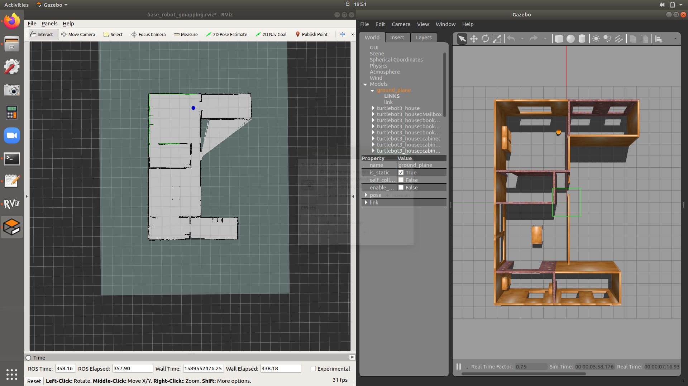

# ros_gazebo_base_mapper
Package containing launch files for gmapping for base_robot. This launch file will bringup,
 - base_robot in gazebo inside the house model
 - rviz
 - teleop-twist-keyboard 
 
You can control the robot using the keyboard (u,i,o,j,k.l,m,',','.') keys, but you need press the keys on the terminal.

Save the map using, in a different terminal.
```
rosrun map_server map_saver -f your_map_name
```
## Dependencies

 - [base_robot](https://github.com/IsuruKalhara/ros_gazebo_base_model)
 - [gmapping](http://wiki.ros.org/gmapping)
 - [turtlebot3_simulations](https://github.com/ROBOTIS-GIT/turtlebot3_simulations) (for the gazebo world file model)

## Preview


